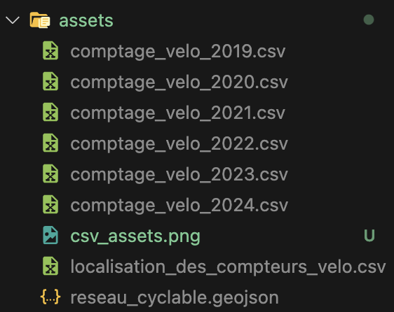

# Projet pour le cours INF8808

1. Install virtual environment `python -m venv .venv`
2. Activate virutal environment
   1. (Linux/MacOS) `source .venv/bin/activate`
   2. (Windows) `.venv\Scripts\activate`
3. Install dependencies `pip install -r requirements.txt`

# Assets

1. Télécharger les fichiers comptage_velo_YYYY.csv de 2019 à 2024 et localisation_des_compteurs.csv [ici](https://www.donneesquebec.ca/recherche/dataset/vmtl-velos-comptage), puis le fichier [reseau_cyclable.geojson](https://www.donneesquebec.ca/recherche/dataset/vmtl-pistes-cyclables).

2. Télécharger les fichiers des conditions météorologiques de 2019 à 2024 à [ce lien-ci](https://climate.weather.gc.ca/climate_data/daily_data_e.html?StationID=51157&timeframe=2&StartYear=1840&EndYear=2024&Day=16&Year=2019&Month=1)

3. Les placer dans le dossier assets
4. Les renommer comme ceci: 
